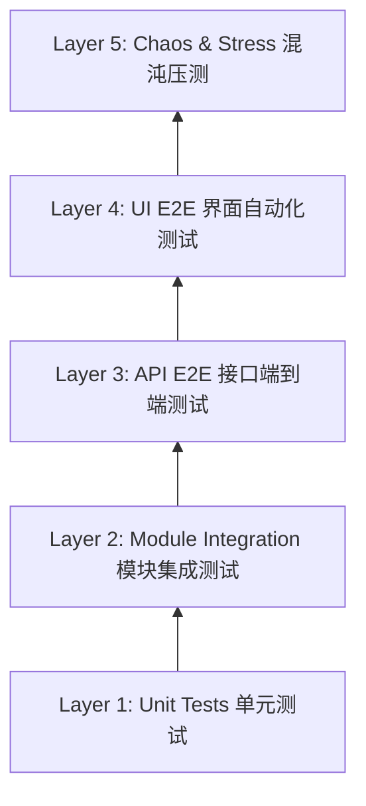
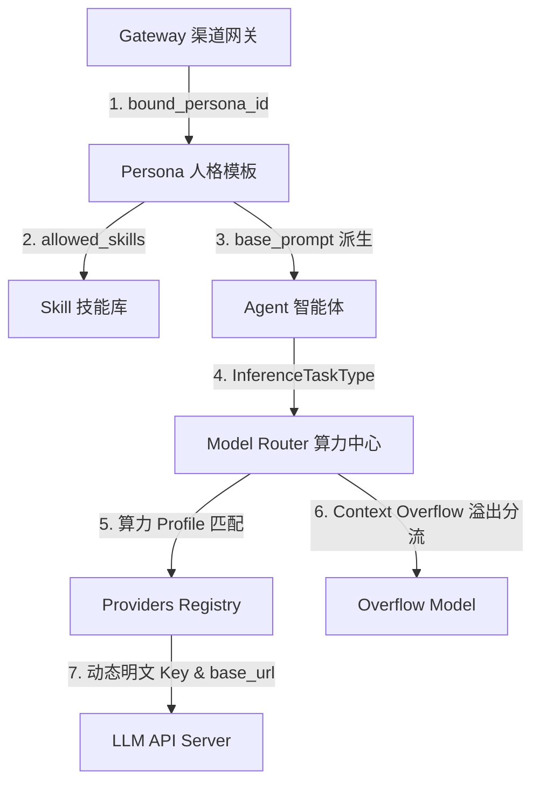

# 端对端 (E2E) 全量测试策略与全按钮反馈清单

为了确保 AI-Nexus 及其底座 API 在持续迭代中的工程稳定性，本规范确立了全量端对端 (End-to-End) 自动化测试策略与反馈断言矩阵。本测试清单覆盖了前端所有物理按钮的后台反馈断言（包含正常响应与异常边界防御），并**重点监控 Gateways、Persona、Agent、Skill、Model Router 五大核心模块的真实依存关系、数据级联联动与混沌容灾能力**。

---

## 1. 测试架构选型与五分层金字塔 (5-Layer Testing Pyramid)

AI-Nexus 采用 Rust (Axum + NexusDB) 后端 + Vite (React + TS) 前端架构，端对端测试分为以下 **5 层渐进式质量保障体系**：



| 测试层级 (Layer) | 工具链 (Toolchain) | 源码/清单存放位置 | 运行指令 (Execution Command) |
| :--- | :--- | :--- | :--- |
| **L1: 单元测试** | Rust 原生 `[#[test]]` | `src/**/*.rs` | `cargo test --lib` |
| **L2: 模块集成测试** | Cargo Integration Tests | `src/ainexus-test/src/` | `cargo test -p ainexus-test` |
| **L3: API E2E 级联测试** | Tokio + `reqwest` | `src/ainexus-test/src/joint/` | `cargo test --test joint_e2e` |
| **L4: UI E2E 界面自动化** | Playwright (TypeScript) | `frontend/tests/e2e/` | `npx playwright test` |
| **L5: 混沌与并发压测** | `criterion` / 自研模拟器 | `benches/` | `cargo bench` |

---

## 2. 前端全按钮后台反馈测试矩阵 (UI Controls & API Response Matrix)

本部分覆盖全站前端页面中的所有物理按钮、表单提交与状态切换。每一个交互动作均包含**正常反馈 (200/201/204)** 与 **异常边界防御 (400/401/404/500)** 的双向断言。

### 2.1 渠道网关页面 (Gateways)

| 前端按钮 / 交互元素 | 触发 API 接口 | 正常 HTTP 反馈断言 (200/201) | 异常 HTTP 响应防御断言 (400/401/404/500) |
| :--- | :--- | :--- | :--- |
| **`+ 新增渠道网关`** | `POST /api/gateways` | **HTTP 200 Created**<br>返回结构包含 `id` 与 `platform`，前端列表动态追加卡片。 | **HTTP 400 Bad Request**<br>提交空网关标识时返回错误提示 JSON，阻止空节点建立。 |
| **`配置` (Gear Icon)** | `PUT /api/gateways/:id/config` | **HTTP 200 OK**<br>更新 `bound_persona` 与 API Key 凭证，前端弹窗关闭并提示保存成功。 | **HTTP 404 Not Found**<br>配置不存在的网关 ID 时，返回 404 且前端展示错误 Alert。 |
| **`运行/停止` (Power Icon)**| `POST /api/gateways/:id/toggle` | **HTTP 200 OK**<br>状态在 `Active` / `Idle` 之间切换，卡片徽章实时变色。 | **HTTP 401 Unauthorized**<br>Token 失效时终止切换并跳转登录页。 |
| **`删除` (Trash Icon)** | `DELETE /api/gateways/:id` | **HTTP 200 OK**<br>从数据库彻底清除节点，前端卡片平滑销毁。 | **HTTP 500 Internal Error**<br>数据库写锁异常时弹出回滚提示。 |

### 2.2 算力中心页面 (Model Router & Providers)

| 前端按钮 / 交互元素 | 触发 API 接口 | 正常 HTTP 反馈断言 (200/201) | 异常 HTTP 响应防御断言 (400/401/404/500) |
| :--- | :--- | :--- | :--- |
| **`+ 新增服务商`** | `POST /api/models/providers` | **HTTP 200 OK**<br>返回 `status: added`，凭证池增加卡片，API Key 自动掩码脱敏。 | **HTTP 400 Bad Request**<br>未填 API Key 或重复提供商 ID 时被阻断。 |
| **服务商 `删除` 按钮** | `DELETE /api/models/providers/:id` | **HTTP 200 OK**<br>凭证池对应服务商节点成功移除。 | **HTTP 404 Not Found**<br>节点已被其他终端删除时优雅刷新。 |
| **`+ 新增算力 Profile`** | `PUT /api/models/routing` | **HTTP 200 OK**<br>提交全量 Profile 字典，包含 `task_types` 数组与 `routing_rules`，网格新增卡片。 | **HTTP 400 Bad Request**<br>未设置 Primary 模型或非法数据时拒绝写入。 |
| **Profile 卡片 `编辑` 按钮** | `PUT /api/models/routing` | **HTTP 200 OK**<br>保存修改后的 Profile，包含多 Task Types 关联与长文本溢出分流模型。 | **HTTP 400 Bad Request**<br>提交非法 JSON 格式时前端报错。 |
| **Profile 卡片 `删除` 按钮** | `PUT /api/models/routing` | **HTTP 200 OK**<br>提交移除了 `profileKey` 的策略，网格平滑删除该卡片。 | **HTTP 500 Internal Error**<br>配置写锁失败时维持原策略不变更。 |

### 2.3 智能体工厂页面 (Agent Factory)

| 前端按钮 / 交互元素 | 触发 API 接口 | 正常 HTTP 反馈断言 (200/201) | 异常 HTTP 响应防御断言 (400/401/404/500) |
| :--- | :--- | :--- | :--- |
| **`+` (创建 Agent)** | `POST /api/agents` | **HTTP 200 OK**<br>生成新 Agent ID，列表中选中新节点，初始化能力与 Persona。 | **HTTP 400 Bad Request**<br>未填写 Agent 名称时阻止发送。 |
| **`保存配置` (FloppyDisk)**| `PUT /api/agents/:id` | **HTTP 200 OK**<br>更新 `capability_requirement` 与 `persona.base_prompt`，前端提示更新成功。| **HTTP 404 Not Found**<br>Agent ID 失效时阻止覆盖并提示刷新。 |
| **`+ Attach New Skill`** | `GET /api/skills` + `PUT` | **HTTP 200 OK**<br>弹窗拉取全部技能池，选择装配后将技能加入 `allowed_skills` 白名单并保存。 | **HTTP 400 Bad Request**<br>装配不存在的非法 Skill 标识时抛出警告。 |
| **Equipped Skill `✕` 图标**| `PUT /api/agents/:id` | **HTTP 200 OK**<br>从 `allowed_skills` 移除该技能，前端 Tag 标签实时消失。 | **HTTP 400 Bad Request**<br>网络断开时恢复原 Tag 渲染。 |

### 2.4 人格管理页面 (Personas)

| 前端按钮 / 交互元素 | 触发 API 接口 | 正常 HTTP 反馈断言 (200/201) | 异常 HTTP 响应防御断言 (400/401/404/500) |
| :--- | :--- | :--- | :--- |
| **`+ 创建 Persona`** | `POST /api/personas` | **HTTP 200 OK**<br>建立新 Persona 模版节点。 | **HTTP 400 Bad Request**<br>未填名称或提示词时阻断。 |
| **`保存修改`** | `PUT /api/personas/:id` | **HTTP 200 OK**<br>更新 `base_prompt`, `tone` 与 `allowed_skills`。 | **HTTP 404 Not Found**<br>更新不存在节点时弹出 404。 |
| **`删除` 人格** | `DELETE /api/personas/:id` | **HTTP 200 OK**<br>节点被成功清理。 | **HTTP 400 Bad Request**<br>该 Persona 正被 Gateway/Agent 强绑定时阻断删除并提示。 |

### 2.5 技能仓库页面 (Skills)

| 前端按钮 / 交互元素 | 触发 API 接口 | 正常 HTTP 反馈断言 (200/201) | 异常 HTTP 响应防御断言 (400/401/404/500) |
| :--- | :--- | :--- | :--- |
| **`编译与发布` (Wasm)** | `POST /api/skills/compile` | **HTTP 200 OK**<br>返回 `wasm_bytes` 编译结果，并将技能成功注册至 GraphRAG。 | **HTTP 400/500 Error**<br>Rust/C 语法编译失败时返回详细编译器 stderr。 |
| **`保存 Skill` (Markdown)**| `POST /api/skills/save_md` | **HTTP 200 OK**<br>在 `core_skills/` 目录下落盘 `SKILL.md` 并注册。 | **HTTP 400 Bad Request**<br>YAML Frontmatter 格式解析错误时阻止保存。 |
| **`删除` 技能** | `DELETE /api/skills/:id` | **HTTP 200 OK**<br>从技能库和 GraphRAG 图谱节点中解绑移除。 | **HTTP 400 Bad Request**<br>保护核心 Core 技能不可被任意销毁。 |

### 2.6 任务调度页面 (Task Scheduler)

| 前端按钮 / 交互元素 | 触发 API 接口 | 正常 HTTP 反馈断言 (200/201) | 异常 HTTP 响应防御断言 (400/401/404/500) |
| :--- | :--- | :--- | :--- |
| **`+ 新增触发器`** | `POST /api/triggers` | **HTTP 200 OK**<br>建立 Cron / Webhook / Poll 任务，并在列表中展示。 | **HTTP 400 Bad Request**<br>Cron 5 字段表达式格式不合法时拦截。 |
| **`Suspend / Resume`** | `PUT /api/triggers/:id` | **HTTP 200 OK**<br>触发器在 `active` 与 `suspended` 之间状态切换。 | **HTTP 404 Not Found**<br>操作非现有触发器时报错。 |
| **`删除` 触发器 (Trash)**| `DELETE /api/triggers/:id` | **HTTP 200 OK**<br>卡片被成功清除，若无卡片自动呈现空状态占位。 | **HTTP 500 Internal Error**<br>数据库访问受阻时弹出重试提示。 |

---

## 3. 八大核心模块级联联动测试用例 (8 Cascading Integration Cases)

核心组件（**Gateways $\rightarrow$ Persona $\rightarrow$ Agent $\rightarrow$ Skill $\rightarrow$ Model Router $\rightarrow$ Providers**）紧密级联。在端对端测试中，必须重点断言以下 8 大数据流转链路：



### 3.1 测试用例 E2E-LINK-01：Gateways $\rightarrow$ Persona 动态绑定与参数覆盖
* **测试步骤**：
  1. 调用 `PUT /api/gateways/Telegram: aura/config` 将 `bound_persona` 更改为 `persona_meta_agent`；
  2. 通过 Telegram 渠道发送测试消息 `"/start"`；
* **断言目标**：
  - 验证后台接收到的请求中，系统 Instruction 严格使用 `persona_meta_agent` 的 `base_prompt`；
  - 验证网关绑定的 Persona 优先级高于全局默认设置。

### 3.2 测试用例 E2E-LINK-02：Persona $\rightarrow$ Skill 授权拦截级联测试
* **测试步骤**：
  1. 调用 `PUT /api/agents/agent_mvp_001`，将 `allowed_skills` 修改为仅包含 `["file_generate"]`（剔除 `web_search`）；
  2. 向该 Agent 发送带有明显网络检索意图的提示词（如 `"查询最新 API 规范"`）；
* **断言目标**：
  - 后台 GraphSkillRegistry 进行检索；
  - **强断言**：发送给 LLM API 的 `tools` 声明列表中**绝对不出现 `web_search`**。

### 3.3 测试用例 E2E-LINK-03：Agent $\rightarrow$ Capability Profile 多任务动态模型调度
* **测试步骤**：
  1. 调用 `PUT /api/agents/agent_mvp_001`，将其 `capability_requirement` 设置为 `"Code-Generation"`；
  2. 配置算力 Profile `"High-Reasoning-Profile"`，使其包含 `task_types: ["Logic", "Code-Generation"]` 并指定 `primary: "claude-3-5-sonnet"`；
  3. 发起推理请求；
* **断言目标**：
  - `ModelRouter::route_task` 精准匹配到 `"High-Reasoning-Profile"` 并返回 `primary: "claude-3-5-sonnet"`；
  - 证明 Agent 算力要求与 Profile 策略实现了**多任务类型动态绑定与无缝调度**。

### 3.4 测试用例 E2E-LINK-04：Context Token 溢出分流重定向测试 (`context_overflow_model`)
* **测试步骤**：
  1. 配置算力 Profile 规则 `routing_rules: { "max_token_threshold": 32768, "context_overflow_model": "gemini-1.5-pro" }`；
  2. 调用 `GET /api/models/routing/resolve?task_type=Code-Generation&estimated_tokens=40000`；
* **断言目标**：
  - 路由解析结果中 `primary` 自动重定向为 `"gemini-1.5-pro"`；
  - 返回 JSON 中 `is_context_overflow` 属性断言为 `true`。

### 3.5 测试用例 E2E-LINK-05：ModelRouter 严格无保底抛错断言 (`ModelRouterError`)
* **测试步骤**：
  1. 传入一个全局未配置且不在默认路由表中的未知任务类型（如 `task_type: "NonExistentTask"`）；
  2. 调用 `GET /api/models/routing/resolve?task_type=NonExistentTask`；
* **断言目标**：
  - 系统**绝对不静默回退**到任何默认模型；
  - API 准确返回 **HTTP 400 Bad Request**，响应 JSON 为 `{ "error": "NoMatchingRoute", "message": "未找到任务类型 'NonExistentTask' 对应的算力 Profile 路由配置" }`。

### 3.6 测试用例 E2E-LINK-06：Provider 凭证池与自定义 Base URL 动态解析
* **测试步骤**：
  1. 调用 `POST /api/models/providers` 添加配置了自定义代理地址 `base_url: "https://my-custom-proxy.com/v1"` 的 Provider 节点；
  2. 触发底座 `GeminiClient` 发起网络请求；
* **断言目标**：
  - 验证后端通过 `GeminiClient::new_with_url` 构造客户端，目标 URL 正确替换为 `https://my-custom-proxy.com/v1/...`；
  - 验证前端展示时 API Key 被成功脱敏（如 `sk-****`）。

### 3.7 测试用例 E2E-LINK-07：WASM 技能在线编译、GraphRAG 装配与沙箱隔离
* **测试步骤**：
  1. 调用 `POST /api/skills/compile` 提交一段标准的 C/Rust 原生技能源码；
  2. 校验编译输出；
* **断言目标**：
  - 编译成功并返回 `wasm_bytes` 字节码；
  - 技能被成功自动装配至 `GraphSkillRegistry` 的向量与拓扑图谱中，且能够在 `WasmSandbox` 内隔离运行。

### 3.8 测试用例 E2E-LINK-08：Cron / Poll 触发器异步定时任务调度
* **测试步骤**：
  1. 调用 `POST /api/triggers` 注册一条近时 Cron 触发器 `*/1 * * * *`；
  2. 等待定时轮询到期；
* **断言目标**：
  - 调度引擎异步唤醒关联 Agent，执行指定指令并向频道推送信道；
  - 触发日志记录完整落盘至 `NexusDb`。

---

## 4. 压测、混沌工程与抗模糊测试 (Stress & Chaos Engineering)

### 4.1 WASM 沙箱多线程并发隔离压测
* **压测用例**：并发启动 50 个 Worker 线程同时调用 `WasmSandbox::execute`。
* **断言目标**：内存映射安全，无数据竞争与指针越界，平均响应延迟小于 15ms。

### 4.2 独立底座断连与数据库降级防护 (Chaos Degradation)
* **模拟故障**：模拟 `NexusDb` 写入锁竞争或物理文件受阻；
* **断言目标**：
  - 访问 `/api/dashboard/stats` 依然正常返回 HTTP 200；
  - 响应中的列表数据自动优雅返回空数组 `[]`（**严禁返回 `null` 引发前端 Crash**）。

### 4.3 接口抗模糊测试 (Fuzzing)
* **断言目标**：
  - 向 `DELETE /api/sessions/invalid_999` 或 `PUT /api/agents/invalid_agent` 发送超长随机 Payload，服务保持稳健，返回优雅 JSON 错误，**严禁发生 Rust Panic 崩溃**。

---

## 5. CI/CD 测试自动化挂载流水线

在 GitHub Actions 流水线（`.github/workflows/e2e.yml`）中挂载自动化端对端校验：

```yaml
name: E2E Cascading Integration Pipeline

on:
  push:
    branches: [ main, dev ]
  pull_request:
    branches: [ main ]

jobs:
  e2e-test:
    runs-on: ubuntu-latest
    steps:
      - uses: actions/checkout@v3

      - name: Setup Rust Toolchain
        uses: dtolnay/rust-toolchain@stable

      - name: Setup Node.js
        uses: actions/setup-node@v3
        with:
          node-version: 18

      - name: Check Rust Compilation (0 Warning Assert)
        run: cargo check --all-targets

      - name: Run Unit & Model Router Tests
        run: cargo test --lib -- --nocapture

      - name: Frontend Typecheck
        run: |
          cd frontend
          npm install
          npx tsc --noEmit

      - name: Run Joint E2E Cascading Integration Tests
        run: cargo test --test joint_e2e -- --nocapture
```

通过本测试策略清单，确保 AI-Nexus 从底层数据模型、算力 Profile 调度到顶层前端交互的每一个环节都拥有严密的工程质量保障。
