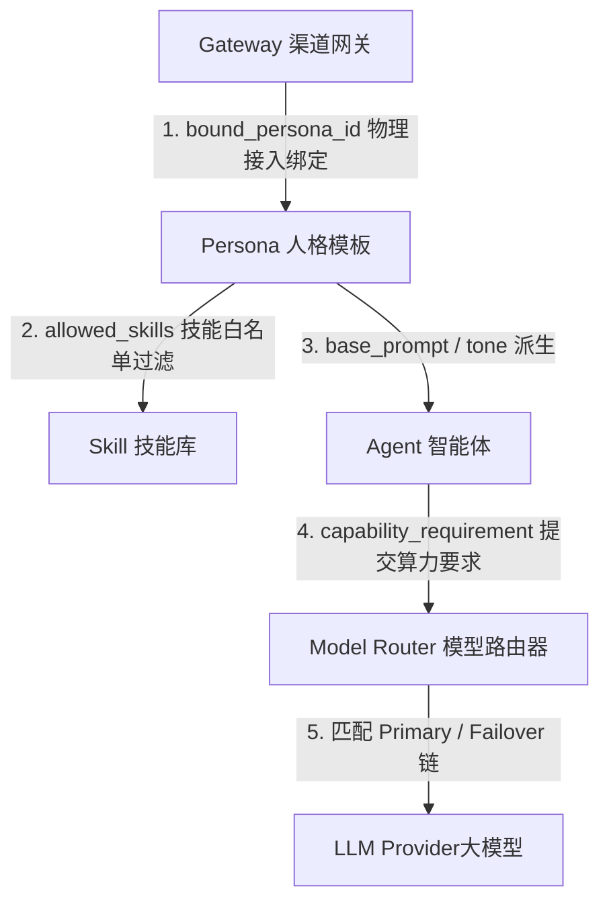

# 端对端 (E2E) 全量测试策略与全按钮反馈清单

为了确保 AI-Nexus 及其底座 API 在持续迭代中的工程稳定性，本规范确立了端对端 (End-to-End) 自动化测试流水线。本测试清单覆盖了前端所有物理按钮的后台反馈断言（包含正常与异常处理），并**重点监控 Gateways、Persona、Agent、Skill、Model Router 五大核心模块的真实依存关系与数据级联联动**。

---

## 1. 测试架构选型与分层

AI-Nexus 采用 Rust (Axum + NexusDB) 后端 + Vite (React + TS) 前端架构，端对端测试分为 **API 联合集成测试 (API E2E)** 与 **前端 UI 交互自动化测试 (UI E2E)** 两个维度：

| 测试维度 | 工具链 | 源码存放位置 | 运行指令 |
| :--- | :--- | :--- | :--- |
| **API E2E** | Rust 原生 `[tokio::test]` + `reqwest` | `tests/joint/api_e2e.rs` | `cargo test --test joint` |
| **UI E2E** | Playwright (TypeScript) | `frontend/tests/e2e/` | `npx playwright test` |

---

## 2. 前端全按钮后台反馈测试清单 (UI Controls & API Feedback Matrix)

本部分覆盖全站 11 个前端页面中的所有物理按钮、表单提交与状态切换。每一个交互动作均包含**正常反馈 (200/201/204)** 与 **异常边界防御 (400/401/404/500)** 的双向断言。

### 2.1 渠道网关页面 (Gateways)

| 前端按钮 / 交互元素 | 触发 API 接口 | 正常 HTTP 反馈断言 | 异常 HTTP 响应防御断言 |
| :--- | :--- | :--- | :--- |
| **`+ 新增渠道网关`** | `POST /api/gateways` | **HTTP 200/201 Created**<br>返回结构包含 `id` 与 `platform`，前端列表动态追加卡片。 | **HTTP 400 Bad Request**<br>提交空网关标识时返回错误提示，阻止空节点建立。 |
| **`配置` (Gear Icon)** | `PUT /api/gateways/:id/config` | **HTTP 200 OK**<br>更新 `bound_persona` 与 API Key 凭证，前端弹窗关闭并提示保存成功。 | **HTTP 404 Not Found**<br>配置不存在的网关 ID 时，返回 404 且前端展示错误 Alert。 |
| **`运行/停止` (Power Icon)**| `POST /api/gateways/:id/toggle` | **HTTP 200 OK**<br>状态在 `Active` / `Idle` 之间切换，卡片徽章变色。 | **HTTP 401 Unauthorized**<br>Token 失效时终止切换并跳转登录页。 |
| **`删除` (Trash Icon)** | `DELETE /api/gateways/:id` | **HTTP 200 OK**<br>从数据库彻底清除节点，前端卡片平滑销毁。 | **HTTP 500 Internal Error**<br>数据库写锁异常时弹出回滚提示。 |

### 2.2 算力中心页面 (Model Router)

| 前端按钮 / 交互元素 | 触发 API 接口 | 正常 HTTP 反馈断言 | 异常 HTTP 响应防御断言 |
| :--- | :--- | :--- | :--- |
| **`+ 新增服务商`** | `POST /api/models/providers` | **HTTP 200 OK**<br>返回 `status: created`，服务商凭证池增加卡片，API Key 自动脱敏。 | **HTTP 400 Bad Request**<br>未填 API Key 或重复提供商 ID 时被阻断。 |
| **服务商 `删除` 按钮** | `DELETE /api/models/providers/:id` | **HTTP 200 OK**<br>凭证池对应服务商移除。 | **HTTP 404 Not Found**<br>节点已被其他终端删除时优雅刷新。 |
| **`+ 新增映射策略`** | `PUT /api/models/routing` | **HTTP 200 OK**<br>提交包含 `newTier` 的全量策略 JSON，网格新增 Tier 卡片。 | **HTTP 400 Bad Request**<br>填入非标 JSON 或空主模型时拒绝写入。 |
| **策略卡片 `删除` 按钮** | `PUT /api/models/routing` | **HTTP 200 OK**<br>提交移除了 `tierKey` 的策略 JSON，网格移除该 Tier 卡片。 | **HTTP 500 Internal Error**<br>配置写锁失败时维持原策略不变更。 |

### 2.3 智能体工厂页面 (Agent Factory)

| 前端按钮 / 交互元素 | 触发 API 接口 | 正常 HTTP 反馈断言 | 异常 HTTP 响应防御断言 |
| :--- | :--- | :--- | :--- |
| **`+` (创建 Agent)** | `POST /api/agents` | **HTTP 200 OK**<br>生成新 Agent ID，列表中选中新节点，初始化能力与 Persona。 | **HTTP 400 Bad Request**<br>未填写 Agent 名称时阻止发送。 |
| **`保存配置` (FloppyDisk)**| `PUT /api/agents/:id` | **HTTP 200 OK**<br>更新 `capability_requirement` 与 `persona.base_prompt`，前端提示更新成功。| **HTTP 404 Not Found**<br>Agent ID 失效时阻止覆盖并提示刷新。 |
| **`+ Attach New Skill`** | `GET /api/skills` + `PUT` | **HTTP 200 OK**<br>弹窗拉取全部技能池，选择装配后将技能加入 `allowed_skills` 白名单并保存。 | **HTTP 400 Bad Request**<br>装配不存在的非法 Skill 标识时抛出警告。 |
| **Equipped Skill `✕` 图标**| `PUT /api/agents/:id` | **HTTP 200 OK**<br>从 `allowed_skills` 移除该技能，前端 Tag 标签实时消失。 | **HTTP 400 Bad Request**<br>网络断开时恢复原 Tag 渲染。 |

### 2.4 人格管理页面 (Personas)

| 前端按钮 / 交互元素 | 触发 API 接口 | 正常 HTTP 反馈断言 | 异常 HTTP 响应防御断言 |
| :--- | :--- | :--- | :--- |
| **`+ 创建 Persona`** | `POST /api/personas` | **HTTP 200 OK**<br>建立新 Persona 模版节点。 | **HTTP 400 Bad Request**<br>未填名称或提示词时阻断。 |
| **`保存修改`** | `PUT /api/personas/:id` | **HTTP 200 OK**<br>更新 `base_prompt`, `tone` 与 `allowed_skills`。 | **HTTP 404 Not Found**<br>更新不存在节点时弹出 404。 |
| **`删除` 人格** | `DELETE /api/personas/:id` | **HTTP 200 OK**<br>节点被成功清理。 | **HTTP 400 Bad Request**<br>该 Persona 正被 Gateway/Agent 强绑定时阻断删除并提示。 |

### 2.5 技能仓库页面 (Skills)

| 前端按钮 / 交互元素 | 触发 API 接口 | 正常 HTTP 反馈断言 | 异常 HTTP 响应防御断言 |
| :--- | :--- | :--- | :--- |
| **`编译与发布` (Wasm)** | `POST /api/skills/compile` | **HTTP 200 OK**<br>返回 `wasm_bytes` 编译结果，并将技能成功注册至 GraphRAG。 | **HTTP 400/500 Error**<br>Rust/C 语法编译失败时返回详细编译器 stderr。 |
| **`保存 Skill` (Markdown)**| `POST /api/skills/save_md` | **HTTP 200 OK**<br>在 `core_skills/` 目录下落盘 `SKILL.md` 并注册。 | **HTTP 400 Bad Request**<br>YAML Frontmatter 格式解析错误时阻止保存。 |
| **`删除` 技能** | `DELETE /api/skills/:id` | **HTTP 200 OK**<br>从技能库和 GraphRAG 图谱节点中解绑移除。 | **HTTP 400 Bad Request**<br>保护核心 Core 技能不可被任意销毁。 |

### 2.6 任务调度页面 (Task Scheduler)

| 前端按钮 / 交互元素 | 触发 API 接口 | 正常 HTTP 反馈断言 | 异常 HTTP 响应防御断言 |
| :--- | :--- | :--- | :--- |
| **`+ 新增触发器`** | `POST /api/triggers` | **HTTP 200 OK**<br>建立 Cron / Webhook / Poll 任务，并在列表中展示。 | **HTTP 400 Bad Request**<br>Cron 5 字段表达式格式不合法时拦截。 |
| **`Suspend / Resume`** | `PUT /api/triggers/:id` | **HTTP 200 OK**<br>触发器在 `active` 与 `suspended` 之间状态切换。 | **HTTP 404 Not Found**<br>操作非现有触发器时报错。 |
| **`删除` 触发器 (Trash)**| `DELETE /api/triggers/:id` | **HTTP 200 OK**<br>卡片被成功清除，若无卡片自动呈现空状态占位。 | **HTTP 500 Internal Error**<br>数据库访问受阻时弹出重试提示。 |

---

## 3. 五大核心模块依存关系与数据级联联动测试 (5-Module Cascading Integration & Data Linkage Test Cases)

五大模块（**Gateways $\rightarrow$ Persona $\rightarrow$ Agent $\rightarrow$ Skill $\rightarrow$ Model Router**）并非孤立存在。在端对端测试中，必须重点监控以下数据级联与链式联动：



### 3.1 测试用例 E2E-LINK-01：Gateways $\rightarrow$ Persona 联动路由测试
* **测试步骤**：
  1. 调用 `PUT /api/gateways/Telegram: aura/config` 将 `bound_persona` 更改为 `persona_meta_agent`；
  2. 通过 Telegram 渠道发送测试消息 `"/start"`；
* **断言目标**：
  - 断言后台接收到的请求日志中，系统 Instruction 严格使用 `persona_meta_agent` 的 `base_prompt`；
  - 即使全局配置默认 Person 不是 Meta Agent，网关绑定的 Persona 优先级高于全局默认设置。

### 3.2 测试用例 E2E-LINK-02：Persona $\rightarrow$ Skill 授权拦截级联测试 (白名单过滤强断言)
* **测试步骤**：
  1. 调用 `PUT /api/agents/agent_mvp_001`，将 `allowed_skills` 修改为仅包含 `["file_generate"]`（剔除 `web_search`）；
  2. 向该 Agent 发送带有明显网络检索意图的提示词（如 `"查询 API 最新版本"`）；
* **断言目标**：
  - 后台 GraphSkillRegistry 检索相关技能；
  - **强断言**：发送给 Gemini API 的 `tools[0].function_declarations` 列表中**绝不出现 `web_search`**；
  - 模型无法调用未在 Persona 白名单中授权的 Skill。

### 3.3 测试用例 E2E-LINK-03：Agent $\rightarrow$ Model Router 动态算力分发级联测试
* **测试步骤**：
  1. 调用 `PUT /api/agents/agent_mvp_001`，将其 `capability_requirement` 改为 `"Tier-3-Fast"`；
  2. 调用 `PUT /api/models/routing`，将 `Tier-3-Fast` 的 `primary` 改为 `"gemini-2.0-flash-exp"`；
  3. 向 `agent_mvp_001` 发起通讯请求；
* **断言目标**：
  - 断言后台输出日志 `Sending request via Model Router to target model: gemini-2.0-flash-exp`；
  - 证明 Agent 的算力需求更改与 Model Router 的映射策略修改实现了**实时零延迟数据联动**。

### 3.4 测试用例 E2E-LINK-04：Skill Protocol Buffer Schema 防错清洗联动测试
* **测试步骤**：
  1. 注册一个 Schema 中包含非标 Union 数组 `type: ["object", "string"]` 或缺省 `items` 的 `array` 字段的自定义 Skill；
  2. 发起 Agent 推理请求；
* **断言目标**：
  - 验证后台 `sanitize_gemini_schema` 能够自动完成类型防御清洗（将数组转换为单值字符串 `"string"`，为 `array` 自动补全 `"items": { "type": "string" }`）；
  - **强断言**：LLM 响应不抛出 `HTTP 400 Bad Request`，且 Function Calling 能正常触发。

---

## 4. 容灾降级与异常边界自动化测试

### 4.1 独立底座断连容灾 (Graceful Degradation)
* **模拟环境**：关闭外部数据库服务或模拟 BlockStore 掉线；
* **断言目标**：
  - 访问 `/api/dashboard/stats` 依然正常返回 HTTP 200，且 `api_health_trend` 回退至 `"Waiting for DB"`；
  - 前端所需的所有数组字段（如 `gateways`, `skills_usage`, `tokenTrend`）返回空数组 `[]`，严格禁止返回 `null` 引发前端渲染崩溃。

### 4.2 接口抗模糊测试与越权防护 (Negative Fuzzing & IAM Security)
* **断言目标**：
  - 尝试调用 `DELETE /api/sessions/invalid_id_9999`，服务必须保持稳健且返回优雅 JSON，严禁发生 Rust Panic 崩溃；
  - 不带 Bearer Header 访问任何 API，严格切断并返回 **HTTP 401 Unauthorized**。

---

## 5. CI/CD 测试自动化挂载流水线

在 GitHub Actions 流水线（`.github/workflows/e2e.yml`）中挂载自动化端对端校验：

```yaml
name: E2E Cascading Integration Pipeline

on:
  push:
    branches: [ main, dev ]
  pull_request:
    branches: [ main ]

jobs:
  e2e-test:
    runs-on: ubuntu-latest
    steps:
      - uses: actions/checkout@v3

      - name: Setup Rust Toolchain
        uses: dtolnay/rust-toolchain@stable

      - name: Setup Node.js
        uses: actions/setup-node@v3
        with:
          node-version: 18

      - name: Check Rust Compilation
        run: cargo check --all-targets

      - name: Frontend Typecheck
        run: |
          cd frontend
          npm install
          npx tsc --noEmit

      - name: Run API E2E & Joint Tests
        run: cargo test --test joint_e2e -- --nocapture
```

通过本测试策略清单，确保 AI-Nexus 从底层数据模型到顶层前端交互的每一个环节都拥有严密的工程质量保障。
