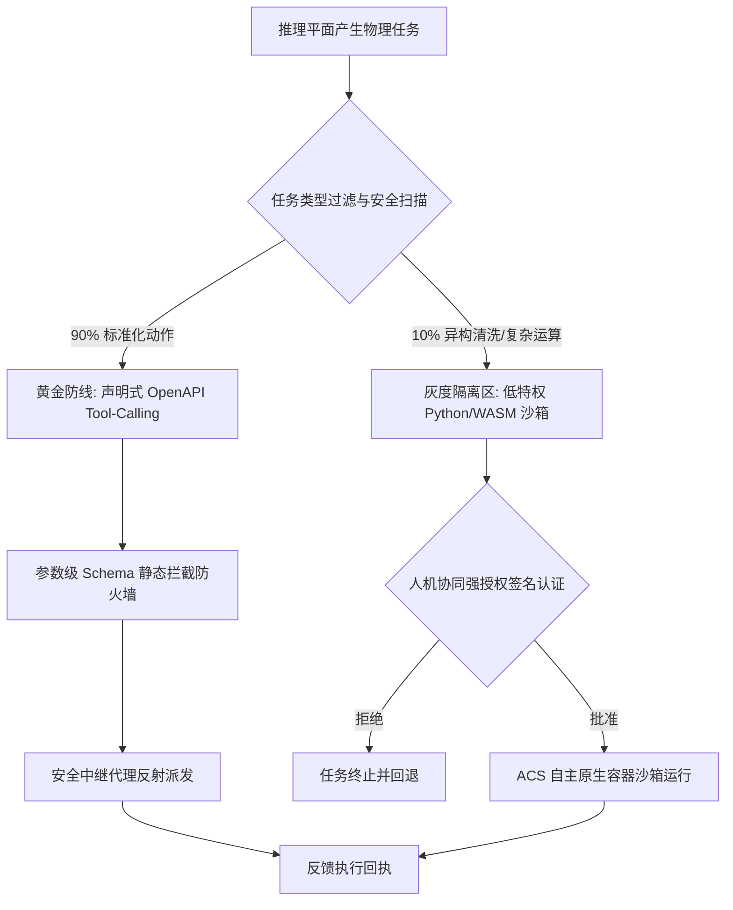

# 黄金-灰度双轨隔离执行技术论证文档 (01_TECH_HYBRID_EXECUTION)

本论证文档详细阐述在 AI-Nexus 高性能操作系统级 AI 代理框架中，物理执行平面（L3/L4）采用 **「黄金-灰度双轨隔离制（Hybrid Architecture）」** 的理论基础、设计架构、安全防护边界与状态转换模型。

---

## 1. 架构演进背景与核心痛点 (Problem Statement)

AI-Nexus OS 原设计采用 **「强类型 DSL (ExecutionDsl) 驱动模型」**，推理层生成的任务必须精确匹配 `WebHook` 或 `PythonHook` 结构体。这种范式虽然具备极强的确定性，但暴露出两大工业级痛点：
1. **契约库编译膨胀**：每次在现实场景中增加或变更一种物理技能（如特定异构 API 或硬件控制），都必须修改核心 `ainexus-core` 的契约定义，导致整个 Workspace 重新编译，系统插拔灵活性极差。
2. **AI 自演化自由度受限**：大模型无法直接利用其强大的代码生成能力（Code Generation）来编写临时数据清洗或自愈脚本，窒息了代理框架的“自主进化”潜能。

然而，若走向另一个极端 ── **纯代码即数据 (Code-As-Data) 沙箱运行**，则宿主机将暴露出无限大的**物理攻击面**（如 Fork Bomb 派生炸弹、局域网内网 SSRF 渗透、DNS Rebinding DNS重绑定劫持等高危漏洞），这在操作系统级常驻软件中是绝对不可接受的。

---

## 2. 黄金-灰度双轨隔离系统定义 (Hybrid System Definition)

为了达成 **“宿主机的绝对安全防御”** 与 **“AI 自演化的无限自主度”** 的终极平衡，AI-Nexus 执行平面全面升级为「黄金-灰度双轨隔离制」：



### 2.1 黄金防线 (The Golden Path - OpenAPI Tool-Calling)
*   **物理机制**：90% 的标准化物理交互（如向电报发送卡片、简单网络嗅探、Substrate 固化检索等）强制走受限的声明式工具调用。整个系统仅维护一份静态的 OpenAPI Schema，大模型输出 `call_tool(tool_name, arguments)`。执行层维护动态注册工具集，通过中继代理在内存中直接反射执行。
*   **特性**：**参数级 Schema 静态防火墙拦截**，攻击面仅局限在合规参数中，零代码执行风险，能耗开销极低。为了保障性能，执行平面在内存中常驻一个并发安全的动态工具注册表 `Arc<RwLock<BTreeMap<String, Box<dyn PhysicalTool>>>>`，每次 `call_tool` 在微秒级完成反射派发，实现 **零磁盘 IO 损耗**。

### 2.2 灰度隔离区 (The Gray Sandbox - Air-gapped Code Runtime)
*   **物理机制**：针对极其复杂的定制化异构脚本、非标准数学模型推算或流式数据清洗任务。大模型可直接输出 Python/WASM 原生脚本。
*   **特性**：**人机协同强安全授权**。未经用户在交互层显式授权（状态处于 `pending_feedback`），灰度脚本保持绝对静默。一旦获得签名激活，立刻将其投放至三层物理强隔离沙箱中执行。

---

## 3. ACS (AI-Nexus Container Sandbox) 自主原生隔离沙箱设计 (ACS Sandbox Architecture)

为了防范恶意或故障代码穿透灰度隔离区危害宿主机，并彻底摒弃依赖外部 Docker 的 DooD 机制，AI-Nexus 建立了纯 Rust 实现的自主原生隔离沙箱系统——ACS。该系统由两个并行的物理隔离引擎驱动：

### 3.1 废除 DooD 的物理考量 (Why Abolish DooD)
原设计的 DooD 隔离模式因强制挂载 `/var/run/docker.sock` 并拉起外部兄弟容器，带来了高昂的冷启动延迟（300ms ~ 1.5s）、宿主机 Docker 运行时强依赖（破坏了 AI-Nexus OS 的自给自足独立性）以及进程生命周期失控（非 AI-Nexus 子进程导致无法强掐或捕获标准 I/O）。ACS 沙箱通过进程内直接发起系统调用，在零外部依赖的前提下实现 1~5ms 极致冷启动与绝对安全。

### 3.2 引擎 A：ACS-L (Linux Kernel Native Sandbox)
针对需要运行 Python/Bash 异构动态脚本的灰度任务，ACS-L 利用 Linux 内核原生 API 构建高强度的微型容器沙箱：
1. **六重命名空间 (Namespaces) 彻底物理隔离**：
   在派生子进程时直接调用 `unshare` 剥离系统资源：
   - `CLONE_NEWNS` (挂载)：隔离宿主机挂载点，子进程无法查看物理磁盘。
   - `CLONE_NEWNET` (网络)：彻底断网（Air-gapped 孤岛），仅保留空 loopback，彻底截断内网 SSRF 渗透与敏感数据外泄。
   - `CLONE_NEWPID` (进程)：沙箱内进程成为 PID 1，无法嗅探、干预宿主机进程。
   - `CLONE_NEWIPC` (通信)：隔离共享内存与 POSIX 消息队列。
   - `CLONE_NEWUTS` (主机)：强制隔离主机名。
   - `CLONE_NEWUSER` (用户)：在无 Root 特权运行 AI-Nexus 时，将沙箱内 UID/GID 映射为内部虚拟 root，从而在沙箱命名空间中合法获取 `CAP_SYS_ADMIN` 特权以安全执行联合文件挂载与 chroot，做到完全 Rootless 独立运行。
2. **极简 Base Rootfs 与 OverlayFS 零磁盘残留挂载（附持久化卷支持）**：
   - **零残留机制**：挂载精简只读 Base Rootfs（仅含运行 Python 所需的最简依赖，如 `/usr/bin/python3`, `/lib64/libc.so`）。将默认的读写层（UpperDir）和工作区（WorkDir）挂载为内存 `tmpfs` 虚拟文件系统。所有的临时文件修改和创建都在内存中进行，沙箱销毁时一切磁盘写污染瞬间化为乌有，做到 **100% 物理零磁盘残留**。
   - **持久化绑定挂载（Bind Mount）**：若技能配置了 `volumes` 持久化映射，在执行 `unshare(CLONE_NEWNS)` 隔离挂载点之后、`pivot_root` 切入沙箱根目录之前，执行引擎将读取映射字典。针对每个映射项，先在沙箱临时根目录下递归创建挂载目标路径（`sandbox_path`），随后执行 `mount(host_path, sandbox_path, NULL, MS_BIND, NULL)` 将宿主机专属持久化目录挂载进沙箱。
   - **只读挂载机制**：若 `volumes` 中的 `readonly` 属性为 `true`，则需紧接着对目标路径执行 `mount(NULL, sandbox_path, NULL, MS_BIND | MS_REMOUNT | MS_RDONLY | MS_NOSUID | MS_NODEV, NULL)` 进行只读重新挂载，严禁沙箱内脚本对其进行写操作。
   - **防逃逸路径校验**：为防止大模型生成恶意路径映射穿透沙箱，宿主机路径 `host_path` 在执行挂载前，必须进行严格的绝对路径规范化校验（如使用 Rust 的 `fs::canonicalize`），强制要求其限定在当前 Workspace 根目录或特定子目录下，禁止对宿主机敏感目录（如 `/etc`, `/var`, `/root`）进行挂载。
   - 使用 `chroot/pivot_root` 彻底切断根目录物理访问权限。
3. **Cgroups v2 物理配额限额保护**：
   - 在 `/sys/fs/cgroup/ainexus.slice/` （符合 systemd 命名规范的 cgroup 控制组）下为每个沙箱创建独立的控制组。
   - `memory.max` 锁定最大物理内存 RSS 为 **256MB**，防止恶意 OOM 导致宿主机挂死。
   - `cpu.max` 锁定 CPU 使用率最高不超过单核的 **20%**，免疫大模型代码的 Fork Bomb 提权与失控死循环。
4. **Async-Signal-Safety 信号安全规范**：
   - **信号安全铁律**：在多线程 Tokio 运行时下，`fork` 派生子进程后、`exec` 前，子进程处于极度敏感的单线程环境，任何堆内存分配（如 `malloc` 全局锁）或复杂业务逻辑都可能导致**永久性死锁**。ACS 强制要求所有 OverlayFS 挂载准备、cgroup 文件夹分配与路径拼接均**前置在父进程中闭环完成**。`pre_exec` 闭包内仅允许调用预先分配好路径常量的 async-signal-safe 系统调用。
5. **Seccomp-BPF 系统调用白名单过滤**：
   - **加载时序**：在 `pre_exec` 中，OverlayFS 联合挂载与 `pivot_root` 根目录切换在 Seccomp 加载**之前**执行。Seccomp-BPF 过滤器作为 `pre_exec` 的最后一步加载，锁死子进程后续**整个运行时**的系统调用面。
   - **运行时白名单**：仅放行 `read`, `write`, `exit`, `mmap` 等约 35 个安全系统调用。对 `socket`, `mount`, `reboot`, `ptrace` 等系统调用返回 `EPERM` 或发送 `SIGSYS` 物理熔断进程，从内核级斩断穿透提权攻击。

### 3.3 引擎 B：ACS-W (WebAssembly WASI Sandbox)
针对无需本地解释器的极速物理计算，内置 Wasmtime 引擎作为 ACS-W 微沙箱：
1. **Epoch 级算力燃料精准控制 (Fuel-based Limit)**：
   - 实例化 Store 时强行注入 WASM 燃料限额，一旦耗竭瞬间触发**指令级安全熔断**，避免死循环。
   - 硬性限制 WASM 最大内存页数为 **128MB**，超额即自动物理熔断。
2. **绝对去网络化与零本地磁盘映射**：
   - 禁用 WASI Sockets 扩展协议，使编译后的字节码在指令集层面便不具备套接字网络发包的物理逻辑。
   - 不映射任何宿主机的物理磁盘目录，仅通过标准 I/O 管道流式输出字节回执，保证 100% 安全防御。


---

## 4. 状态流转时序与因果链 (Lifecycle & Causal Graph)

```
[Inference Plane]           [Substrate Substrate]          [Execution Plane]          [Interaction Plane]
      |                              |                             |                            |
      |-- 1.思维推演与计划 --------->|                             |                            |
      |   (InferenceTaskRecord)      |                             |                            |
      |   (status: pending_feedback) |                             |                            |
      |                              |<-- 2.查询待授权任务 --------------------------------------|
      |                              |                                                          |-- 3.推送一键授权卡片给用户
      |                              |<-- 4.用户点击同意 (RECORD_LIFE, is_authorized=true) -----|
      |                              |    (status: pending_execution)
      |                              |                             |                            |
      |                              |<-- 5.定时轮询授权任务 ------|                            |
      |                              |                             |-- 6.判定双轨属性 ---------|
      |                              |                             |   - 黄金: 动态反射执行     |
      |                              |                             |   - 灰度: ACS 容器沙箱隔离 |
      |                              |<-- 7.回传执行结果 (RECORD_LIFE, is_executed=true) -------|
      |                              |   (status: pending_feedback)|                            |
      |                              |<-- 8.轮询抓取已执行反馈 ---------------------------------|
      |                              |                                                          |-- 9.将物理图赏/结果回传用户
```

---

## 5. 演进落地路线图 (Evolutionary Roadmap)

*   **P43-P45 节点（已完成）**：完成了黄金-灰度双轨隔离物理落地、Hook 产物集中管理，以及 ACS 自主容器沙箱的完整设计与文档重构（废除 DooD、确立 ACS-L/ACS-W 双引擎方案）。
*   **P46 节点（短期）**：在 `ainexus-execution` 中落地 ACS-L 的六重 Namespace 物理编码、OverlayFS 内存挂载与 Seccomp-BPF 白名单加载，替代现有的零散 `setrlimit`/`unshare(CLONE_NEWNET)` 过渡实现。
*   **P47 节点（中期）**：集成 Wasmtime 引擎实现 ACS-W 微沙箱，完成 Engine 全局单例化与 Fuel 级算力控制的代码落地。


---


# 02. AI-Nexus OS 与传统 Agent 平台 Skill 架构对比论证 (docs/02_TECH_SKILL_COMPARISON.md)

本文档旨在对比 AI-Nexus OS 的 Skill（技能）引擎架构与传统 Agents 平台（如 LangChain、AutoGPT、OpenAI Function Calling 等）的设计差异，分析各自的优劣势，探讨兼容性，并提出面向未来的架构演进与改进建议。

## 1. 核心区别对比

| 维度 | 传统 Agents 平台 Skill/Tool | AI-Nexus OS 物理技能 (Skill Engine) |
| :--- | :--- | :--- |
| **运行环境** | 大多与主进程同属一个内存空间，或在简单的 Docker 容器中运行。 | 物理断链。采用 ACS 隔离沙箱，基于 Cgroups v2 和 Seccomp-BPF 进行系统调用级和硬件级限制。 |
| **生命周期与热更新** | 往往是硬编码的 Python/TS 函数（如 `@tool` 装饰器）。修改需重启应用。 | 具备完整的 CI/CD 管线。分为 `ainexus-developer` (开发生成) 和 `ainexus-execution` (只读执行)，支持大模型动态写代码、校验并热加载，无需重启内核。 |
| **文件组织** | 散落在代码仓库中的各类函数或模块。 | 标准化目录结构：按 UUID 划分，包含 `SKILL.md`（Schema 与声明）与 `skill.py`（<100行的执行代码）。 |
| **权限与安全控制** | 依赖应用层逻辑鉴权，若 AI 生成恶意代码容易直接穿透主机（如 `os.system('rm -rf')`）。 | 操作系统级零信任。强制 Air-gapped 断网（除非白名单授权），强制只读绑定挂载（RO Bind Mount），剥夺对自身的写权限以防止链式劫持。 |
| **通信机制** | 内存函数调用，直接返回对象或 JSON。 | 通过 UDS (Unix Domain Socket) IPC 通信，使用严格的 ACP 二进制协议传输。 |

## 2. 优势与劣势分析

### 2.1 AI-Nexus OS 的架构优势 (Advantages)
1. **宿主机的绝对防御**：彻底解决了 AI 代码生成能力带来的安全隐患。通过 256MB 内存上限、20% CPU 限制以及 Fork 限制，使得无论是死循环还是 Fork Bomb，都只能在沙箱内瞬间崩溃，不会波及 AI-Nexus 底座。
2. **AI 自演化物理闭环**：大模型可以在不干预系统内核代码（Rust）的前提下，自主生成 Python 技能脚本，通过自动化 Dry-run 测试后注册成为永久技能，实现了真正意义上的“工具库自我生长”。
3. **消除契约膨胀**：废弃了 `ainexus-core` 中硬编码的 Action 枚举，实现了技能的无限动态插拔。

### 2.2 AI-Nexus OS 的架构劣势 (Disadvantages)
1. **开发与执行开销较大**：每一个简单的动作都需要拉起 ACS 沙箱、挂载 Namespace 并通过 UDS 序列化/反序列化通信，对于极度高频且简单的计算密集型操作，这种“重装甲”架构的延迟开销大于传统的内存函数调用。
2. **场景受限（100行与断网限制）**：强制 Python 脚本不超过 100 行，且剥夺了大量的系统调用（仅放行 40 个）。这使得移植复杂的数据处理库（如 Pandas 大型清洗）或复杂的原生 C 扩展工具变得困难。
3. **架构复杂度高**：双子项目（Python 开发 + Rust 隔离执行）增加了系统的部署难度和运维门槛。

## 3. 兼容性探讨 (Compatibility)

**在“协议与接口层”高度兼容，但在“执行环境层”不直接兼容。**

1. **Schema 兼容（完全可行）**：
   AI-Nexus 的 `SKILL.md` 中定义的 `input/output` 数据字典，可以非常轻松地被大模型（或转换脚本）翻译为 OpenAI 标准的 JSON Schema（Function Calling 规范），这意味着前端大模型可以将 AI-Nexus 的技能无缝视作常规 Tool 进行规划。
2. **代码级直接兼容（不可行）**：
   传统平台中那些带有隐式全局变量依赖、复杂环境依赖，或者需要无限制网络访问、文件系统读写的 Python Tool，**无法**直接放入 AI-Nexus 的 `skills/` 目录运行。它们必须被重构为标准的 `def execute(args: dict) -> dict:` 入口，且必须通过系统合规扫描（行数限制、非法系统调用剔除等）。

## 4. 架构演进与改进建议 (Improvement Suggestions)

针对目前 AI-Nexus OS 技能引擎的设计，提出以下工业级改进建议，以供后续迭代参考：

1. **宏技能（Macro-Skills / Workflow Orchestration）编排机制**
   * **痛点**：单技能受限于 100 行代码，无法处理复杂业务。
   * **建议**：在 `ainexus-developer` 中引入技能编排 DSL（如类似于 YAML 的 DAG 图）。允许一个复合技能（Macro-Skill）在沙箱外部按顺序或并行调用多个原子技能，并将前一个技能的 `output` 映射为下一个技能的 `input`，从而绕过单脚本代码量限制。

2. **状态共享与临时暂存区 (Ephemeral Scratchpad)**
   * **痛点**：目前沙箱是无状态的，如果两个技能需要处理同一份巨大的文件，通过 UDS 传递二进制数据会造成严重的 IPC 拥堵。
   * **建议**：在技能说明文件 `SKILL.md` 中引入 `session_shared_memory: true` 配置。在同一轮会话（Session）中，AI-Nexus 内核为这些沙箱挂载同一个内存文件系统 (`tmpfs`) 作为临时暂存区（Scratchpad），任务结束后统一销毁。

3. **传统 Tool 的一键转换管线 (Auto-Adapter Pipeline)**
   * **痛点**：存在生态孤岛问题。社区有大量优秀的 LangChain/LlamaIndex Tools 无法直接使用。
   * **建议**：在 `ainexus-developer` 中开发一个 `Import Subsystem`。当输入一个 GitHub 上的开源传统 Python Tool 时，大模型自动对其进行代码重构：将其拆分为主入口和 `libs/` 依赖，自动生成 `SKILL.md` 并剥除危险的 OS 调用，自动将其包装为符合 AI-Nexus 规范的安全技能。

4. **动态资源配额升降级 (Dynamic Quota Scaling)**
   * **痛点**：硬编码的 256MB/20% CPU 可能对某些合理的合规任务（如图片处理）不够用。
   * **建议**：将资源配额下放至 `SKILL.md` 契约中（设置上限的上限，如最高不得超过 1GB）。如果沙箱因 OOM 崩溃，底座可以结合大模型的判断，动态提权资源配额并进行重试，而不是直接返回失败。


---


# AI-Nexus 技能库构建指南：安全可控的执行引擎

知识库给了 AI-Nexus“大脑”，而技能库（Skill Base）则赋予了 AI-Nexus 改变物理世界的“双手”。在企业环境中，技能的调用必须被绝对关在笼子里。

## 1. ACS 物理沙箱防线 (AI-Nexus Container Sandbox)

所有具有外部副作用（Side-effect）的技能，无论是发起网络请求、操作数据库还是运行一段 Python 脚本，都必须在 `ainexus-execution` 引擎分配的隔离沙箱中运行。

<div style="background-color: #1e1e1e; padding: 20px; border-radius: 8px; color: #d4d4d4; font-family: monospace;">
  <div style="border-bottom: 1px solid #333; padding-bottom: 10px; margin-bottom: 10px; color: #facc15;">
    <b>⚠️ ACS Sandbox Restrictions Applied</b>
  </div>
  <pre style="margin: 0; color: #9cdcfe; background: transparent; border: none; padding: 0;">
{
  "sandbox_type": "ephemeral_tmpfs",
  "network_policy": {
    "outbound": "ALLOW_WHITELIST_ONLY",
    "whitelist": ["api.github.com", "slack.com"],
    <span style="color: #ef4444;">"anti_ssrf": true,            // 拦截所有 10.x.x.x, 192.168.x.x 等内网段请求</span>
  },
  "file_system": {
    "mount_point": "/run/ainexus/task_0x9F3B",
    <span style="color: #ef4444;">"rootfs": "READ_ONLY",</span>
    "tmp_size_limit": "50MB"
  },
  "resource_limits": {
    <span style="color: #10b981;">"max_execution_time_ms": 5000, // 严防死循环，超时强制 SIGKILL</span>
    "max_memory_mb": 128
  }
}
  </pre>
</div>

<br>

## 2. 技能开发与注册流水线

为了防止不受控的代码进入执行集群，企业必须建立标准的技能发布生命周期（Lifecycle）。

<div style="background-color: #ffffff; padding: 20px; border: 1px solid #e2e8f0; border-radius: 8px;">
  <h4 style="margin-top: 0; color: #334155; text-align: center;">Enterprise Skill CI/CD Pipeline</h4>
  <div style="display: flex; flex-direction: column; gap: 10px;">
    <!-- Step 1 -->
    <div style="display: flex; align-items: center; border: 1px solid #cbd5e1; border-radius: 6px; overflow: hidden;">
      <div style="background-color: #3b82f6; color: white; padding: 10px 15px; font-weight: bold; min-width: 120px; text-align: center;">1. Developer</div>
      <div style="padding: 10px 15px; font-size: 0.9em; color: #475569;">开发部门基于 AI-Nexus Python SDK 编写技能逻辑，定义清晰的入参 (Input Schema)。</div>
    </div>
    <!-- Step 2 -->
    <div style="display: flex; align-items: center; border: 1px solid #cbd5e1; border-radius: 6px; overflow: hidden;">
      <div style="background-color: #eab308; color: white; padding: 10px 15px; font-weight: bold; min-width: 120px; text-align: center;">2. Audit (自动化)</div>
      <div style="padding: 10px 15px; font-size: 0.9em; color: #475569;">提交后，CI 触发代码静态扫描，检查是否包含未授权库或硬编码的 Secrets 凭证。</div>
    </div>
    <!-- Step 3 -->
    <div style="display: flex; align-items: center; border: 1px solid #cbd5e1; border-radius: 6px; overflow: hidden;">
      <div style="background-color: #f97316; color: white; padding: 10px 15px; font-weight: bold; min-width: 120px; text-align: center;">3. SecReview</div>
      <div style="padding: 10px 15px; font-size: 0.9em; color: #475569;">高危技能（如对核心 DB 的写入操作）强制要求企业安全管理员 (Admin) 审查批准。</div>
    </div>
    <!-- Step 4 -->
    <div style="display: flex; align-items: center; border: 1px solid #cbd5e1; border-radius: 6px; overflow: hidden;">
      <div style="background-color: #10b981; color: white; padding: 10px 15px; font-weight: bold; min-width: 120px; text-align: center;">4. Registry</div>
      <div style="padding: 10px 15px; font-size: 0.9em; color: #475569;">技能被打包签名，注册到 AI-Nexus 的 Private Skill Registry 中，供 Inference 层调度。</div>
    </div>
  </div>
</div>

## 3. Human-in-the-Loop (人工拦截验证)

对于某些极其敏感的破坏性操作（如清理服务器空间、批准财务拨款），AI-Nexus 引擎提供了原生的**交互式等待状态机制**。

当 Bot 推理出需要执行此类动作时：
1. `ainexus-execution` 挂起（Suspend）该任务。
2. 触发回调，通过 `ainexus-interaction`向管理员发送包含全栈上下文的审批卡片。
3. 只有当管理员在 UI (AI-Nexus Dashboard) 或内部 IM 软件（如钉钉/Slack）中明确点击 **"Approve"** 后，沙箱才被允许继续执行并完成闭环。


---


